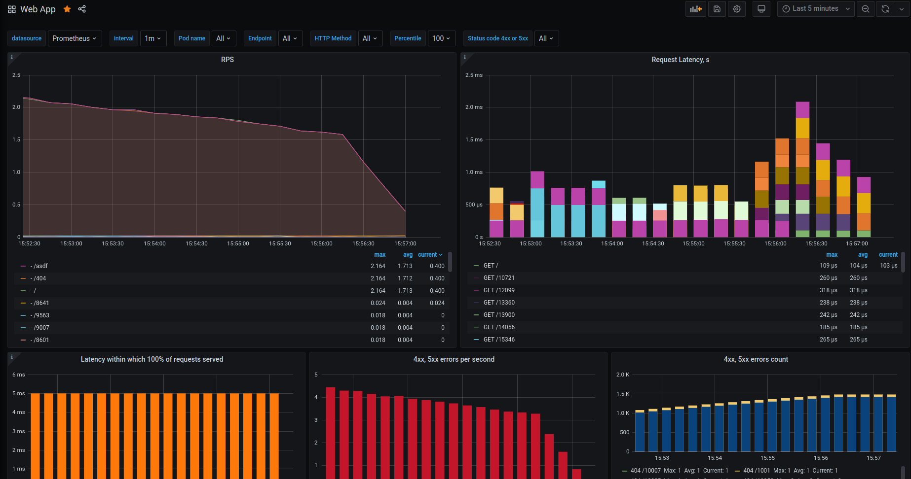
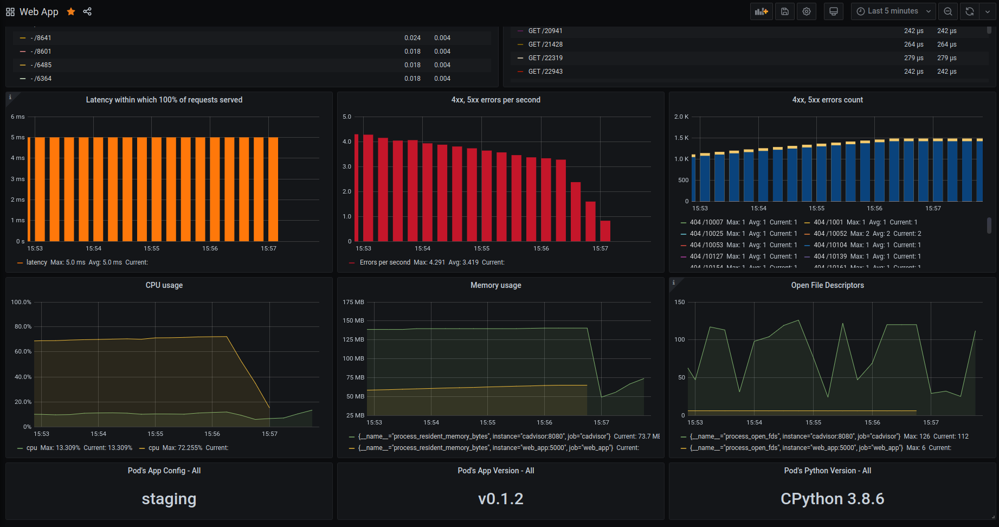

# Web App with Metrics Demo

## Build and run

This project uses docker-compose to build and run all the required services.
Make sure you have docker-compose installed () and run the following command on the main directory of this project:

```
docker-compose up
```

## Exposed services and endpoints

Once the services are up and running, the following services should be available:

* Prometheus: http://localhost:9090/
* Grafana dashboard: http://localhost:3000/login
* Web application: http://localhost:5000/
* Web application metrics: http://localhost:5000/metrics
* cAdvisor: http://localhost:8080/

## Grafana

Grafana is available on http://localhost:3000/login. The credentials are:

* Username: admin
* Password: admin

You can find the following dashboards already configured:

* Web App: it shows metrics from the web application.
  http://localhost:3000/d/u_DVKhQiz/web-app?orgId=1&refresh=5s
* Docker containers: metrics of all the running containers:
  - cadvisor
  - grafana
  - prometheus
  - web_app
  http://localhost:3000/d/KiNZkr-Gz/docker-containers?orgId=1&refresh=10s

## Web App

It's a simple web application written in python3, using flask.

The metrics are exported using [flask_prometheus_metrics](https://github.com/pilosus/flask_prometheus_metrics).

## Generate traffic on the app

In order to generate metrics to visualize interesting data on prometheus/grafana, you can execute this simple loop in bash:

```bash
while true; do curl localhost:5000/$RANDOM; curl localhost:5000/; curl localhost:5000/metrics; curl localhost:5000/404; curl localhost:5000/asdf; sleep 0.01; done
```

## Screenshots

### Web App dashboard


<br />

